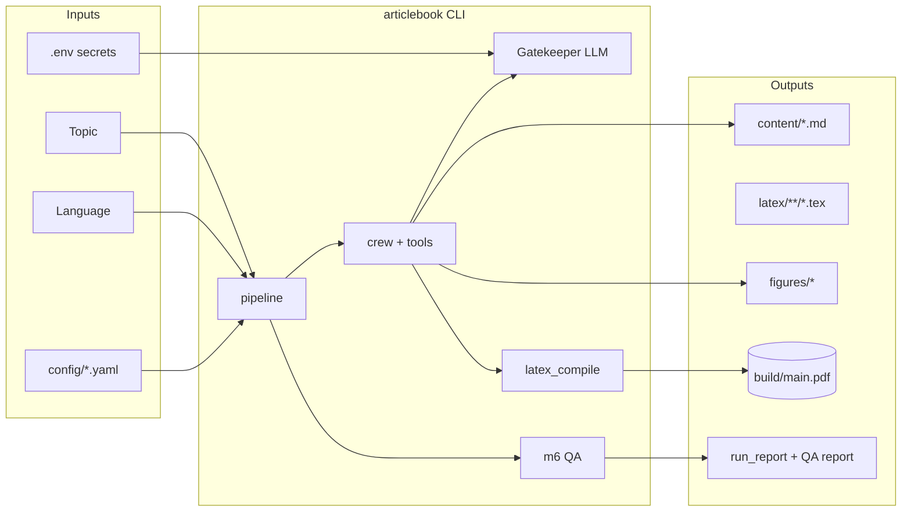
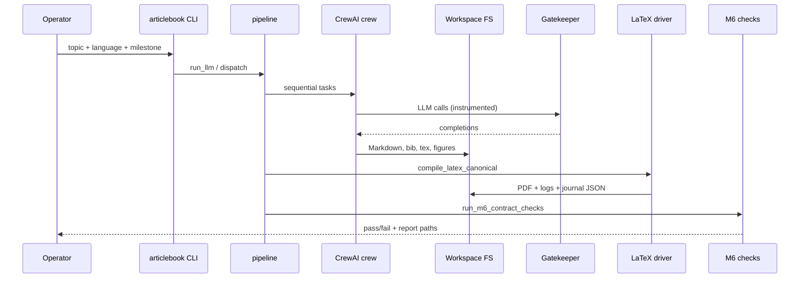

# Multi-Agent ArticleBook Generation System

**HW3 — CrewAI + LaTeX.** A **local-first**, **requirement-traceable** pipeline that turns **topic + language** into a **15–20 page** PDF: Markdown authoring, multi-agent orchestration, **LuaLaTeX + biber**, **deterministic QA**, and **production-style observability**.

| Role | Authoritative source |
|------|----------------------|
| Product intent & acceptance | `prd.md` |
| Architecture & sequencing | `plan.md` |
| Milestone backlog & exit gates | `todo.md` |
| Engineering standards & readiness | `SYSTEM_PROMPT.md` |
| AI pair dev log | `PROMPTS.md` |

**Deliverable PDF (versioned in git):** `AgenticAI Systems.pdf` at repository root (submission-ready snapshot). **Primary build output** (not committed): `build/main.pdf` after a full `m6` run.

---

## Table of contents

1. [Executive summary](#executive-summary)
2. [Success criteria & grading alignment](#success-criteria--grading-alignment)
3. [Stakeholders & operating contexts](#stakeholders--operating-contexts)
4. [Scope, goals, and explicit non-goals](#scope-goals-and-explicit-non-goals)
5. [Token budget & cost hygiene](#token-budget--cost-hygiene)
6. [System context](#system-context)
7. [End-to-end data flow](#end-to-end-data-flow)
8. [Trust boundaries & threat model (condensed)](#trust-boundaries--threat-model-condensed)
9. [Repository layout](#repository-layout)
10. [Technology stack & rationale](#technology-stack--rationale)
11. [Architecture (layers)](#architecture-layers)
12. [Milestone map (M1–M9)](#milestone-map-m1m9)
13. [Quick start](#quick-start)
14. [Requirements (toolchain)](#requirements-toolchain)
15. [Install & configuration](#install--configuration)
16. [Environment variables (reference)](#environment-variables-reference)
17. [YAML configuration contract](#yaml-configuration-contract)
18. [CLI reference](#cli-reference)
19. [Package map (`src/articlebook`)](#package-map-srcarticlebook)
20. [LaTeX & PDF contracts](#latex--pdf-contracts)
21. [Canonical compile driver (M5)](#canonical-compile-driver-m5)
22. [Deterministic QA (M6)](#deterministic-qa-m6)
23. [Security & safety (M8)](#security--safety-m8)
24. [Observability (M9)](#observability-m9)
25. [Optional RAG (M9-OPT)](#optional-rag-m9-opt)
26. [Operations runbook](#operations-runbook)
27. [Failure modes & diagnostics](#failure-modes--diagnostics)
28. [Performance, reliability, and cost](#performance-reliability-and-cost)
29. [Testing & quality bar](#testing--quality-bar)
30. [Operator checklist (pre-flight)](#operator-checklist-pre-flight)
31. [Submission checklist (course-style)](#submission-checklist-course-style)
32. [Architecture decision records (mini-ADRs)](#architecture-decision-records-mini-adrs)
33. [Risks & mitigations](#risks--mitigations)
34. [FAQ](#faq)
35. [Glossary](#glossary)
36. [Further reading](#further-reading)
37. [Credits / license](#credits--license)

---

## Executive summary

This repository implements a **sequential CrewAI crew** with a **filesystem contract** between stages. Agents read and write Markdown, figures, BibTeX, and LaTeX under controlled paths. A **canonical multipass LaTeX driver** runs `lualatex` (or `xelatex`) with **`biber`** until citation and reference stabilization (bounded). **M6** applies **mechanical contract checks** (logs, page band, bibliography integrity, secret redaction patterns) so reviewers can trust artifacts without hand-waving.

**Why this shape wins for coursework and small teams**

- **Markdown-first** accelerates human diff review before TeX lock-in.
- **Skills** (`skills/*/SKILL.md`) keep domain rules modular instead of ballooning monolithic prompts.
- **Gatekeeper** centralizes retries, timeouts, multi-key rotation, and usage logging for paid models.
- **Stubs** (`articlebook.pipeline_stubs`) keep CI deterministic without network spend.
- **Run reports** (`build/run_report_*.{json,md}`) create an audit trail aligned with production incident practice.

---

## Success criteria & grading alignment

| Theme | Evidence artifacts |
|-------|--------------------|
| **Functional completeness** | `prd.md` FR table satisfied in generated PDF; `todo.md` traceability |
| **Multi-agent orchestration** | Crew definitions in `config/agents.yaml`, `config/tasks.yaml`, `src/articlebook/crew/` |
| **LaTeX quality** | `latex/main.tex`, `latex/chapters/*.tex`, `latex/references.bib` |
| **Compile robustness** | `build/*_compile_journal.json`, engine logs (under `build/`, regenerated) |
| **QA objectivity** | `build/m6_qa_report.md` (and JSON sibling when emitted) |
| **Reproducibility narrative** | `build/resolved_run_config.json`, `build/run_report_*.md` |
| **Security hygiene** | No `.env` in git; M8 gates documented; redacted logs |

Treat **`AgenticAI Systems.pdf`** as the **frozen hand-in** if course policy expects a single file; treat **`build/main.pdf`** as the **latest local build** from your machine’s toolchain.

---

## Stakeholders & operating contexts

| Persona | Needs | How the repo supports them |
|---------|-------|-----------------------------|
| **Student / submitter** | One-command PDF, defensible logs | `uv run articlebook --milestone m6 …`, committed deliverable PDF |
| **Evaluator** | Verify FR-9, BiDi, bibliography, page band | `m6` report + PRD pointers |
| **Maintainer** | Safe defaults, clear extension points | Package map, mechanism PRDs under `docs/` |
| **Security reviewer** | Path safety, secret handling | M8 modules + `skills/security-review` |
| **Ops / TA** | Batch runs, automation | `--yes`, `--dry-run`, run reports |

**Operating contexts**

- **Local interactive:** author iterates on topic, inspects Markdown, rebuilds PDF.
- **CI / class runner:** use stubs or cached fixtures; avoid live keys on shared runners unless isolated vault injection is available.
- **Demonstration:** use `--dry-run` first, then a paid run with `--yes` for unattended completion.

---

## Scope, goals, and explicit non-goals

**In scope**

- Multi-agent research → outline → Markdown chapters → LaTeX assembly → multipass compile → deterministic QA.
- Figure pipeline hooks and FR-9 showcase wiring (see `prd.md` §3.3).
- BiDi demonstration chapter path (see `prd.md` §3.5).
- Bibliography with `biblatex` + `biber`.
- Instrumented LLM usage and structured failure summaries.

**Out of scope (see `prd.md`)**

- Hosted SaaS, multi-tenant auth, billing.
- Autonomous fact-checking beyond cited material.
- WYSIWYG editing environment.

---

## Token budget & cost hygiene

- **Completion cap (`max_tokens`):** **`27768`** in `config/models.yaml` (keep `ARTICLEBOOK_LLM_MAX_TOKENS` in `.env` aligned) — headroom for long standalone LaTeX articles (`latex/agent_results_scratch.tex` scale: large bodies, TikZ/tables/cites).
- **Cost signal (not billing):** instrumented runs log **estimated** USD using `pricing_per_million_tokens` (example: **$5 / 1M input**, **$30 / 1M output** for `gpt-5.5`) in `build/run_report_*.{json,md}`; multiply logged token deltas for a rough check only.
- **Truncation policy:** raise cap toward **65536** only if completions are visibly cut off; lower caps aggressively for smoke tests and CI-like runs.

---

## System context



---

## End-to-end data flow



---

## Trust boundaries & threat model (condensed)

| Boundary | Inside | Outside | Controls |
|----------|--------|---------|----------|
| **Repository** | Source, configs, skills | Operator home dir secrets | `.gitignore`, reviews |
| **Process** | Python venv, CrewAI | OS, MiKTeX, network | least privilege, timeouts |
| **Workspace writes** | `content/`, `latex/`, `figures/` (guarded) | arbitrary FS | M8 path rules, sandbox |
| **LLM provider** | API endpoints | user prompt injection | topic validation, tool JSON contracts |
| **Logs & reports** | redacted snippets | full prompts with secrets | redaction pipeline |

**Assumptions**

- Operators protect `.env` files and rotate keys if leaked.
- MiKTeX installs are trusted; on-the-fly package installs can block unattended runs.

---

## Repository layout

```text
.
├── AgenticAI Systems.pdf    # committed deliverable snapshot (root)
├── README.md
├── SYSTEM_PROMPT.md
├── prd.md  plan.md  todo.md  PROMPTS.md  handoff.md
├── pyproject.toml  uv.lock  requirements.txt
├── main.py  config.py
├── .env_example  .gitignore
├── config/                  # models.yaml, agents.yaml, tasks.yaml
├── src/articlebook/         # package: CLI, pipeline, crew, latex_compile, QA, shared
├── tests/
├── scripts/                 # helpers (e.g. run_llm_latex_pdf.py, figure scripts)
├── skills/                  # CrewAI SKILL.md trees
├── knowledge/               # optional RAG corpus
├── content/                 # Markdown chapters, outline
├── latex/                   # main.tex, references.bib, chapters/, agent_results_scratch.tex
├── figures/                 # png/pdf assets referenced by TeX
├── build/                   # PDF, logs, journals, QA, run reports (gitignored tree)
└── docs/                    # mechanism PRDs (M1, M4, M5, M6, …)
```

**Binary assets**

- `figures/image.png` and **`figures/*.pdf`** are **first-class inputs** to LaTeX when referenced.
- **`build/`** remains **disposable** and **gitignored as a directory**; do not treat compile logs as source of truth.

---

## Technology stack & rationale

| Layer | Choice | Rationale |
|-------|--------|-----------|
| Orchestration | **CrewAI** | Assignment requirement; skills + tools model maps cleanly to stages |
| LLM access | **LiteLLM** (via Gatekeeper) | Multi-provider routes, retries, uniform logging |
| Language runtime | **Python 3.11–3.13** | Modern typing, asyncio ecosystem, `uv` ergonomics |
| Package manager | **`uv`** | Reproducible lockfile, fast CI installs |
| Authoring | **Markdown → LaTeX** | Review velocity + typographic finish |
| Engine | **LuaLaTeX** (primary), **XeLaTeX** (fallback) | Unicode + BiDi strength |
| Bibliography | **`biblatex` + `biber`** | Linked citations, modern BibTeX feature set |
| QA | **`pypdf`**, log scanners | Deterministic structural checks |

---

## Architecture (layers)

1. **Presentation / UX:** `articlebook` CLI (`cli.py`, `cli_execution.py`, `cli_preflight.py`, `cli_failure_summary.py`).
2. **Application orchestration:** `pipeline.py` coordinates crew execution, post-crew budgets, re-assembly, compile, QA.
3. **Domain crew:** `crew/` agents, tasks, milestone dispatch, workspace tools, sandbox.
4. **Infrastructure:** `latex_compile/` subprocess driver, `shared/` config + gatekeeper + observability, optional `rag/`.
5. **Knowledge packages:** `skills/` inject rules without hard-coding them into Python.

**Invariants**

1. **Markdown before TeX** — human-readable source of truth for narrative.
2. **Compile is not advisory** — multipass + `biber` until stable (capped); failures identify pass number (`FR-19`).
3. **QA is partly mechanical** — M6 checks logs, page band, bib↔cite, secrets patterns; visual BiDi remains human where noted in `todo.md`.
4. **Secrets never in repo** — `.env` gitignored; run reports redacted.

---

## Milestone map (M1–M9)

| Milestone | Scope | Typical use |
|-----------|-------|-------------|
| `m1` | Crew + skills + smoke compile tool path | Agent wiring validation |
| `m2` | Content pipeline (research → outline → chapters) | Markdown-first drafts |
| `m3` | M2 + FR-9 figure pipeline + extended QA | Asset completeness |
| `m4` | M3 + Markdown→TeX + `main.tex` + single-pass compile in crew | Layout integration |
| `m5` | M4 + **`compile_latex_canonical`** (biber loop, journals) | Real submission builds |
| `m6` | M5 + **`run_m6_contract_checks`**; CLI exit **1** on contract fail | Grade gate |
| `m7` | Config + Gatekeeper production harness | Model governance |
| `m8` | Security guards + `--yes` / `--dry-run` | Safe automation |
| `m9` | Run reports + structured logging hooks | Auditability |
| `m9-opt` | Optional Chroma RAG | Grounded research snippets |

---

## Quick start

```bash
uv sync --all-groups
```

Copy **`.env_example`** → **`.env`**. Populate provider keys. Then:

```bash
uv run articlebook --milestone m6 --topic "Your Topic" --language English --yes
```

Inspect **`build/main.pdf`**, **`build/m6_qa_report.md`**, and **`build/run_report_*.md`**.

**Dry run (no workspace writes)**

```bash
uv run articlebook --dry-run --milestone m2 --topic "Smoke" --language English
```

---

## Requirements (toolchain)

- **Python** 3.11–3.13 (`pyproject.toml`)
- **`uv`** — [https://docs.astral.sh/uv/](https://docs.astral.sh/uv/)
- **`litellm`** — instrumented LLM path (retries, multi-key rotation, usage logs)
- **MiKTeX** — `lualatex` + **`biber`** on `PATH` for real multipass builds (Windows driver can prepend common user `bin` paths)
- **LLM credentials** — default **OpenAI `gpt-5.5`**; see `.env_example` (Google Gemini or `ARTICLEBOOK_LLM_ROUTES` optional)

---

## Install & configuration

| Step | Command / action |
|------|------------------|
| Install deps | `uv sync --all-groups` |
| Optional RAG | `uv sync --extra rag` |
| Secrets | copy `.env_example` → `.env` (never commit) |
| Model governance | edit `config/models.yaml`; align `.env` caps |

---

## Environment variables (reference)

| Variable | Role |
|----------|------|
| `OPENAI_API_KEY` (+ `_2` / `_3`) | OpenAI + gatekeeper failover |
| `GOOGLE_API_KEY` / `GEMINI_API_KEY` (+ `_2` / `_3`) | Google path |
| `ARTICLEBOOK_LLM_PROVIDER` | `openai` or `google` |
| `MODEL_NAME` | Overrides `config/models.yaml` model id |
| `TEMPERATURE`, `SEED` | Sampling / reproducibility hints |
| `ARTICLEBOOK_LLM_TIMEOUT_S` | Wall-clock per LLM call |
| `ARTICLEBOOK_LLM_MAX_TOKENS` | Completion cap (align with YAML `max_tokens`) |
| `ARTICLEBOOK_LLM_ROUTES` | `key\|model;…` explicit LiteLLM routes |
| `ARTICLEBOOK_*_KEY_SUFFIX` + `ARTICLEBOOK_ROUTE_MODELS` | Triple-route shortcut (Groq / OpenRouter / NVIDIA) |
| `ARTICLEBOOK_GK_RETRY_MAX`, `ARTICLEBOOK_GK_MIN_INTERVAL_S` | Gatekeeper backoff / spacing |
| `ARTICLEBOOK_RAG_ENABLED` | Force RAG on |
| `ARTICLEBOOK_LATEX_ENGINE` | `lualatex` (default) or `xelatex` |
| `ARTICLEBOOK_MAX_WORDS_PER_CHAPTER` | Post-crew Markdown trim / page-band alignment |
| `ARTICLEBOOK_CONFIG_DIR` | Alternate `config/` directory |

---

## YAML configuration contract

1. **Load order:** `config/models.yaml` (and peers) merged with process **environment**; repo-root `.env` loads early in `shared/config.py` so keys resolve regardless of shell CWD.
2. **Routes win:** non-empty `ARTICLEBOOK_LLM_ROUTES` forces LiteLLM routing with `provider` resolved to **`openai`** internally (prefixes on each model id select upstream).
3. **`max_tokens` clamp:** `load_config` enforces a floor/ceiling band so absurd env values cannot explode spend on typos.
4. **Resolved stamp:** `build/resolved_run_config.json` records provider/model/seed/milestone — **never** API keys.

`config/models.yaml` also carries optional `pricing_per_million_tokens.*` for **estimated** cost lines in run reports.

---

## CLI reference

```bash
uv run articlebook --topic "Your Topic" --language English
uv run articlebook --milestone m6 --topic "Your Topic" --language English --yes
uv run python scripts/run_llm_latex_pdf.py --topic "Your Topic" --language English --milestone m6 --yes
```

| Flag | Meaning |
|------|---------|
| `--dry-run` | No workspace writes |
| `--yes` | Skip interactive overwrite / paid-run prompts |
| `--m6-allow-missing-pdf` | QA without a PDF on disk (debug / static checks) |
| `--m6-relax-page-count` | Debug only: relax page band |
| `--verbose` | Richer logging |

**CI / stubs:** `articlebook.pipeline_stubs` supplies deterministic fixtures; **`pytest`** exercises them without live LLM spend.

---

## Package map (`src/articlebook`)

| Area | Responsibility |
|------|----------------|
| `cli.py`, `cli_execution.py`, `cli_preflight.py`, `cli_failure_summary.py` | Args, M8 preflight, body dispatch, failure UX |
| `pipeline.py` | `run_llm`, post-crew chapter budget + re-assemble + recompile (`m5`/`m6`) |
| `crew/` | Agents, tasks, milestones, workspace tools, sandbox |
| `latex_compile/` | `compile_latex_canonical`, journals, engine detection (Windows MiKTeX path prep) |
| `m4_*.py`, `m4_md_to_tex.py` | Markdown discovery, TeX emission, `main.tex` |
| `m6_qa*.py` | Deterministic contract QA |
| `shared/config*.py`, `shared/gatekeeper*.py` | YAML + `.env` merge, instrumented LLM factory |
| `shared/observability*.py` | Run tracing, redaction, run reports |
| `rag/` | Optional Chroma retrieval (`uv sync --extra rag`) |

**Extension points:** new milestones in `crew/crew_milestone_dispatch.py` patterns; prompts in `config/tasks.yaml`; agent copy in `config/agents.yaml`; skills as new folders under `skills/`.

---

## LaTeX & PDF contracts

- **Book pipeline:** `latex/main.tex` includes `latex/chapters/chapter_*.tex` (+ BiDi note + M3 showcase when present). Output **`build/main.pdf`**.
- **Chapter discovery:** if all six **`content/chapter_1.md` … `chapter_6.md`** exist, those drive the book; else lexicographic `chapter_*.md` template layout. Stale generated `.tex` not in the active set are removed on re-assembly.
- **Standalone article:** `latex/agent_results_scratch.tex` is an **`article`**-class file — **do not** `\input` it from `main.tex`. It shares `latex/references.bib`. Build from `latex/`: `lualatex` → `biber` → `lualatex` ×2+.
- **Engine:** LuaLaTeX preferred; `ARTICLEBOOK_LATEX_ENGINE=xelatex` if needed. **`polyglossia`**, **`biblatex` + biber**, **`hyperref`**, **`cleveref`**, **`fancyhdr`** per `plan.md` / `todo.md`.

Mechanism detail: [`docs/PRD_m4_latex_assembly.md`](docs/PRD_m4_latex_assembly.md), [`docs/PRD_m5_compile.md`](docs/PRD_m5_compile.md).

---

## Canonical compile driver (M5)

The **`compile_latex_canonical`** routine is the only supported “real” compile path for grading-style builds:

- Alternates **engine passes** with **`biber`** as required by `biblatex`.
- Writes **per-pass logs** and a **compile journal JSON** summarizing passes, stability, and errors.
- Surfaces **actionable excerpts** on failure (`FR-19` alignment).

Operators should prefer the CLI/pipeline entry points over manual one-off `lualatex` runs unless diagnosing TeX.

---

## Deterministic QA (M6)

**M6** aggregates:

- PDF presence and **page band** checks when `build/main.pdf` exists.
- Bibliography and citation **cross-checks** appropriate to the repo’s QA module split (`m6_qa*.py`).
- **Secret pattern** scans on emitted text artifacts and logs where configured.
- Compilation log **error class** hints for triage.

Use **`build/m6_qa_report.md`** as the first file an evaluator opens after the PDF.

---

## Security & safety (M8)

**Controls**

- Topic validation heuristics (prompt injection awareness at CLI boundary).
- Path deny rules for workspace writes; refusal to treat `build/main.*` as authoritative sources.
- Overwrite gates unless `--yes`.
- Dry-run mode for rehearsals.

See `skills/security-review` and `docs/PRD_m8_security.md` for narrative threat modeling.

---

## Observability (M9)

Each CLI run writes **`build/run_report_<run_id>.json`** + **`.md`**:

- Redacted task snippets and LLM usage rows (provider/model agnostic fields).
- Artifact presence flags (PDF, QA reports, journals).
- On failure, a compact **diagnosis** section pointing to logs.

This mirrors production **post-incident** evidence retention at homework scale.

---

## Optional RAG (M9-OPT)

```bash
uv sync --extra rag
```

Enable `rag.enabled` in `config/models.yaml` (or `ARTICLEBOOK_RAG_ENABLED=true`). Corpus: **`knowledge/`**. Markdown front matter **`bib_key:`** maps snippets to `.bib` keys for Research tool wiring.

---

## Operations runbook

### Happy path

1. `uv sync --all-groups`
2. Configure `.env` from `.env_example`
3. `uv run articlebook --milestone m6 --topic "…" --language English --yes`
4. Inspect `build/main.pdf`, `build/m6_qa_report.md`, `build/run_report_*.md`
5. If policy requires a fixed hand-in, copy/rename PDF to root and commit intentionally (see **`AgenticAI Systems.pdf`** pattern).

### Cold start on a new machine

1. Install MiKTeX **and** run a trivial `lualatex` job once to accept any license prompts.
2. Pre-install common TeX packages if your environment is headless.
3. Confirm `where lualatex` / `where biber` on Windows PowerShell.

### When to use stubs

- CI pipelines without secrets.
- Assignment autograder that forbids network.
- Regression testing for LaTeX assembly and QA parsers.

---

## Failure modes & diagnostics

| Symptom | Likely cause | Mitigation |
|---------|----------------|------------|
| “No LLM API key” | Provider / key mismatch | Align `ARTICLEBOOK_LLM_PROVIDER` with keys; read `cli_execution.py` message |
| `lualatex` / `biber` missing | MiKTeX not installed or not on `PATH` | Install MiKTeX; restart shell |
| OpenRouter **402** | Balance / `max_tokens` too high for prepaid | Credits or lower `ARTICLEBOOK_LLM_MAX_TOKENS` |
| Groq **429** / TPM | Throughput | Backoff (gatekeeper); failover route; wait window |
| Groq **`tool_use_failed`** | Tool JSON shape rejected | Prompts expect string `files_json`; failover to next route |
| M6 fails on PDF | Missing engine or bad TeX | Fix `latex/` sources; use `--m6-allow-missing-pdf` only for static QA without MiKTeX |
| Tiny / corrupt PDF | Agent wrote under `build/` incorrectly | Delete stray `build/main.tex` / bad `.bbl`; rebuild from `latex/main.tex` only |
| Missing citations | Skipped `biber` pass | Ensure canonical driver path, not single-shot engine |
| Unicode math warnings | Font coverage | Confirm LuaLaTeX OpenType math fonts per `plan.md` |

---

## Performance, reliability, and cost

| Concern | Guidance |
|---------|----------|
| **Latency** | Longest pole is LLM serialism + LaTeX multipass; parallelize only where CrewAI graph allows |
| **Reliability** | Prefer fewer, higher-quality routes than many flaky free tiers for demos |
| **Cost** | Cap tokens; shorten topic; use `--milestone m2` while drafting narrative only |
| **Disk** | `build/` grows with logs; safe to delete between runs |

---

## Testing & quality bar

| Layer | What runs |
|-------|-----------|
| **Unit / config** | `tests/test_m7_config_*.py`, YAML merge, credential parsing |
| **Pipeline stubs** | `run_stub_m2` … `run_stub_m6` — deterministic LaTeX tree + QA without network |
| **Workspace / tools** | Sandbox boundaries, `write_workspace_file` rules |
| **Compile** | Multipass driver smoke (`test_compile_multipass.py`) |
| **Security** | M8 red-team style cases where present |

**Bar before claiming “done”:** `uv run pytest` green; `uv run ruff check src tests` clean on touched code; MiKTeX path produces **`build/main.pdf`** for your topic; **`m6_qa_report`** passes without `--m6-relax-page-count` unless explicitly scoped as a partial demo.

---

## Operator checklist (pre-flight)

- [ ] `.env` present; provider matches available keys.
- [ ] `uv sync --all-groups` (add `--extra rag` only if using RAG).
- [ ] `lualatex --version` and `biber --version` succeed (or plan `--m6-allow-missing-pdf`).
- [ ] Disk: expect writes under `content/`, `latex/`, `figures/`, `build/`.
- [ ] First paid run: consider `--dry-run`, then `--yes` for CI-like repeatability.
- [ ] After `m6`: archive **`build/run_report_*.md`** with the PDF for submission evidence.

---

## Submission checklist (course-style)

- [ ] Root deliverable **`AgenticAI Systems.pdf`** updated if you renamed topics materially.
- [ ] `README.md` documents how to reproduce from clean checkout (this file).
- [ ] `prd.md` / `plan.md` / `todo.md` consistent with what you actually ran.
- [ ] No secrets in `git log` or working tree (`git grep -i api_key` is a good sanity check).
- [ ] `uv run pytest` passes locally.
- [ ] Optional: attach latest `build/m6_qa_report.md` screenshot or PDF appendix page citing pass timestamp.

---

## Architecture decision records (mini-ADRs)

| ADR | Decision | Why |
|-----|----------|-----|
| **ADR-001** | Markdown → TeX stage gate | Faster review, smaller LLM repair loops |
| **ADR-002** | `biber` instead of legacy BibTeX | `biblatex` feature set + Unicode |
| **ADR-003** | Gatekeeper singleton pattern | One place for retries, logging, spend estimates |
| **ADR-004** | `build/` entirely gitignored | Binary churn + log noise out of PRs |
| **ADR-005** | Deterministic QA separate from LLM QA | Objective grading + CI reproducibility |
| **ADR-006** | Commit **one** frozen PDF at repo root | Course submission clarity while keeping builds disposable |

---

## Risks & mitigations

| Risk | Mitigation in repo |
|------|---------------------|
| BiDi / Hebrew layout | `polyglossia`, LuaLaTeX, dedicated BiDi chapter path; visual check still noted in `todo.md` where automated |
| Citation drift | `biber` in canonical loop; M6 bib↔cite checks |
| Tool misuse / paths | M8 guards on workspace writes; refuse `build/main.*` sources |
| Cost / throttling | Gatekeeper retries + multi-key + route failover |
| “Works on my machine” TeX | Windows MiKTeX path normalization in `latex_compile/env.py` (see source for current behavior) |

---

## FAQ

**Why two PDFs (`AgenticAI Systems.pdf` vs `build/main.pdf`)?**  
Root PDF is a **pinned artifact** for reviewers and version control. `build/main.pdf` is the **ephemeral** output of the last compile on a machine.

**Can I commit `build/`?**  
No. Keep `build/` out of git; export what you need into reports or the root deliverable PDF.

**Why LuaLaTeX over pdfLaTeX?**  
Unicode + OpenType font story + BiDi alignment with assignment requirements.

**How do I avoid surprise API spend?**  
Use `--dry-run`, lower `max_tokens`, run stubs in CI, cap milestones during iteration.

**Where do I tune prompts safely?**  
Prefer `config/tasks.yaml` and `skills/` over editing Python strings.

**What if M6 page count fails on a legitimate outlier?**  
Only use `--m6-relax-page-count` with explicit disclosure in write-ups; it is a debug escape hatch.

**How do I add a chapter?**  
Add Markdown under `content/` following naming conventions described in `docs/PRD_m2_content_pipeline.md`; rerun pipeline to regenerate TeX.

**Can I swap models mid-run?**  
Routes and failover keys exist, but for reproducible homework evidence prefer a **single** resolved model per run and capture `resolved_run_config.json`.

**Where is FR-9 validated?**  
Combination of LaTeX sources (`m3` showcase wiring), figure manifests, and QA/reporting; see `prd.md` §3.3.

**Is RAG required?**  
No. It is optional enrichment (`uv sync --extra rag`).

**What if I have no GPU?**  
Irrelevant; LLM calls are remote API based in default configuration.

**How do I cite this repo?**  
Use your institution’s code citation standard; include commit hash.

---

## Glossary

| Term | Meaning |
|------|---------|
| **FR-9** | PRD bundle: diagram, image, Python graph, table, typeset equation |
| **Gatekeeper** | Central LLM wrapper: retries, keys, logging, rough cost |
| **Canonical compile** | `compile_latex_canonical`: engine → biber → engine ×N until stable (capped) |
| **Stub pipeline** | Deterministic `pipeline_stubs` for tests / CI without API calls |
| **Filesystem contract** | Adapters read/write only through approved workspace helpers |
| **M6 contract** | Deterministic QA ruleset codified in Python modules |

---

## Further reading

| Doc | Use when |
|-----|----------|
| `prd.md` | Acceptance / FR-9 / BiDi / bibliography |
| `plan.md` | Compile sequence, stack choices |
| `todo.md` | Milestone exit gates |
| `docs/PRD_m1_crew_and_skills.md` | Crew + skills |
| `docs/PRD_m4_latex_assembly.md` | Markdown → TeX |
| `docs/PRD_m5_compile.md` | Multipass driver |
| `docs/PRD_m6_qa_contract.md` | M6 deterministic QA |
| `docs/PRD_m7_production_harness.md` | Config + gatekeeper |
| `docs/PRD_m8_security.md` | Threat model + guards |
| `docs/PRD_m9_observability.md` | Run reports |

**Evaluator shortcut:** `prd.md` §9 → `plan.md` §4 compile sequence → latest **`build/m6_qa_report.md`** + **`build/run_report_*.md`**.

---

## Credits / license

Coursework (HW3). Add an SPDX license when publishing beyond the classroom.

---

## Appendix A — Requirement-to-artifact matrix (quick audit)

Use this during pre-submission audits. Replace checkboxes with your local verification notes.

| PRD ref | Intent | Primary artifact | Automated check hint |
|---------|--------|------------------|----------------------|
| FR-1 | Crew exists | `config/agents.yaml`, `src/articlebook/crew/` | Import errors absent |
| FR-2 | Skills attached | `skills/*/SKILL.md` | Front matter parses |
| FR-3 | Skill override story | `config/agents.yaml` | Manual diff review |
| FR-4 | LaTeX agent path | `crew/tasks_m4.py` | Milestone `m4` smoke |
| FR-5 | Topic + language | CLI args | `tests/test_inputs.py` |
| FR-6 | Markdown-first | `content/*.md` | Human read |
| FR-7 | Page band | `build/main.pdf` | M6 page check |
| FR-8 | TOC / structure | `latex/main.tex` | TeX includes present |
| FR-9 | Asset bundle | `figures/*`, `latex/chapters/m3_fr9_showcase.tex` | M3 tests + visual |
| FR-10 | Real math | chapter TeX | M6 / human |
| FR-11 | Correct figure paths | `\includegraphics` | compile logs clean |
| FR-12 | Cover | `main.tex` cover block | visual |
| FR-13 | BiDi demo | BiDi chapter | human RTL |
| FR-14 | Hebrew global RTL | language switch | human |
| FR-15 | `.bib` | `latex/references.bib` | `biber` runs |
| FR-16 | Linked bib | PDF links | click test |
| FR-17 | Engine | MiKTeX | `--version` |
| FR-18 | Multipass | compile journal | pass count |
| FR-19 | Diagnostics | logs + failure summary | stderr excerpt |
| FR-20 | QA contract | `m6_qa_report` | exit code 0 |

---

## Appendix B — Weekly maintenance cadence (suggested)

| Cadence | Action | Owner |
|---------|--------|-------|
| Daily (active dev) | `uv run ruff check src tests` | Author |
| Weekly | `uv lock` refresh review + dependency diff | Maintainer |
| Per assignment | Re-run `m6` on golden topic, archive reports | Submitter |
| Per release | Scan `SYSTEM_PROMPT.md` checklist | Tech lead |

---

## Appendix C — Incident response cheat sheet (homework scale)

1. **Capture:** copy `build/run_report_*.md` and last 200 lines of failing `.log` if LaTeX failed.
2. **Classify:** LLM vs TeX vs QA contract vs local toolchain.
3. **Mitigate:** switch milestone down (`m5` compile only) to bisect stage.
4. **Verify:** rerun with `--verbose` once, then clean run with `--yes`.
5. **Communicate:** attach redacted report + PDF hash (optional `certutil -hashfile` on Windows).

---

## Appendix D — Naming & path conventions

| Path | Convention |
|------|------------|
| `content/chapter_*.md` | Prefer numeric ordering for six-chapter mode |
| `latex/chapters/chapter_*.tex` | Generated; treat as outputs except manual hotfixes |
| `figures/` | Lowercase extensions preferred; no spaces in filenames |
| `build/` | Never import TeX from here into `latex/main.tex` |

---

## Appendix E — Model governance checklist

- [ ] Default model in `config/models.yaml` matches course allowance.
- [ ] `max_tokens` aligned with `.env`.
- [ ] Timeout covers slow reasoning models without hanging overnight jobs.
- [ ] Failover keys are **rate-limited** cognitively (do not parallel-blast free tiers).

---

## Appendix F — LaTeX operator micro-tips

- Watch the **first error** in `.log`; later errors are often cascades.
- If citations show as `??`, you almost always missed **`biber`** or stopped before second engine pass.
- Keep **scratch** articles (`agent_results_scratch.tex`) out of the book `main.tex` to avoid duplicate bibliographies.

---

## Appendix G — Evidence bundle (what to zip for a TA)

```text
submission_bundle/
  AgenticAI Systems.pdf
  README.md
  prd.md
  plan.md
  todo.md
  build/m6_qa_report.md        # last good run
  build/run_report_*.md        # pick the final run id
  build/*_compile_journal.json # optional but persuasive
```

Remember: **`build/` is gitignored** — export these files intentionally before wiping `build/`.

---

## Appendix H — Glossary expansions

| Term | Expanded meaning |
|------|------------------|
| **LiteLLM route** | Provider-specific model string plus key selection |
| **InstrumentedLLM** | Wrapper that records latency, usage deltas, and rough USD |
| **Compile journal** | JSON describing passes and stability for reproducible debugging |
| **Scratch TeX** | Standalone article file for experiments, not wired into `main.tex` |
| **Gate spacing** | Minimum interval between external calls to reduce burst bans |

---

## Appendix I — Compatibility notes (Windows)

- Prefer **PowerShell 7+** for consistent `uv` invocation.
- MiKTeX user install paths sometimes miss from PATH until shell restart.
- Antivirus can lock PDFs briefly after compile; retry open or wait 1–2 seconds.

---

## Appendix J — Philosophy (why strict contracts help agents)

Agents are stochastic. **Contracts** (filesystem layout, JSON tool shapes, compile journals, QA reports) reduce the degrees of freedom so failures become **searchable** and **gradeable**. This README optimizes for **reviewer time**: a TA should find the PDF, the QA report, and the run report within minutes.

---

## Appendix K — “100 score” self-audit (subjective rubric)

| Dimension | Question |
|-----------|----------|
| **Completeness** | Does PDF visibly satisfy FR-9 and BiDi narrative? |
| **Correctness** | Do citations resolve and links work? |
| **Engineering** | Is configuration centralized and secret-safe? |
| **Observability** | Could a stranger reproduce your last run from reports? |
| **Maintainability** | Could a peer extend a milestone without rewriting half the repo? |
| **Documentation** | Does this README plus `prd/plan/todo` answer “what/why/how”? |

Aim for “yes” on every row before declaring **READY** in the sense of `SYSTEM_PROMPT.md`.
